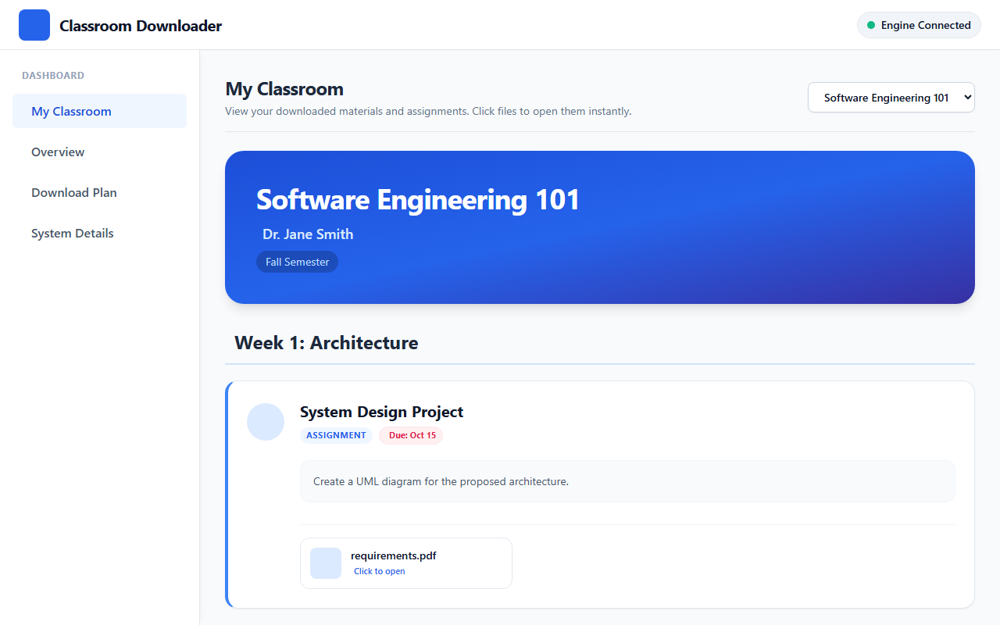
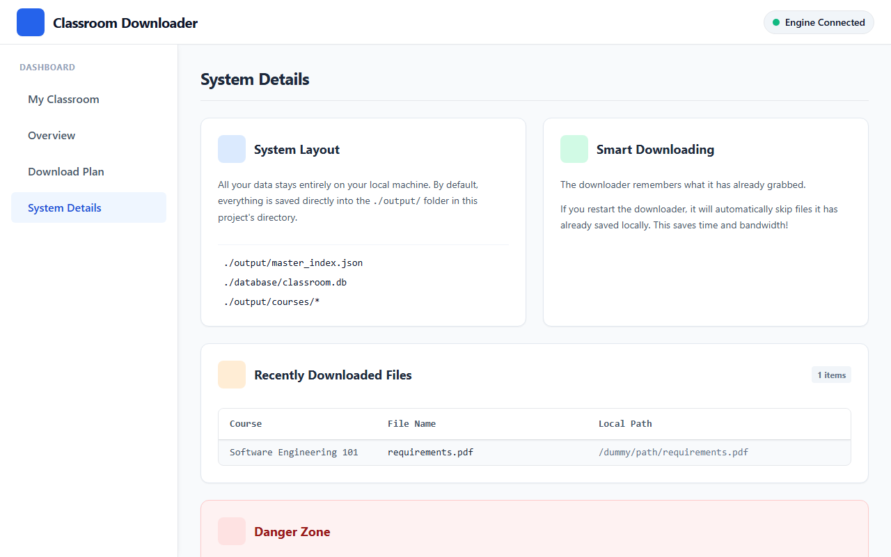
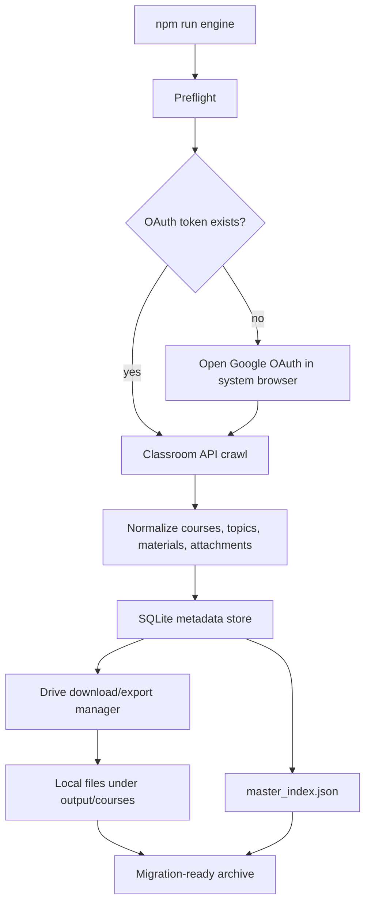
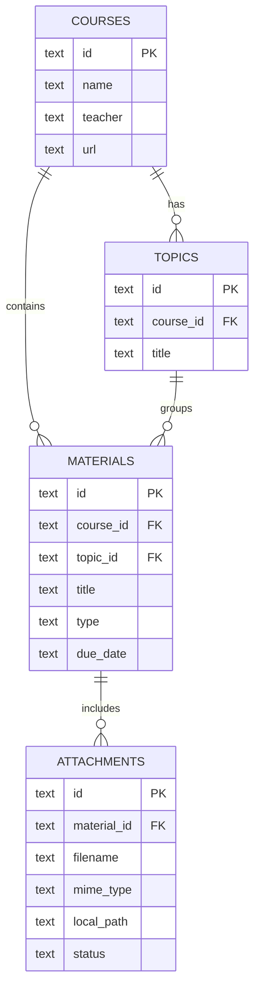
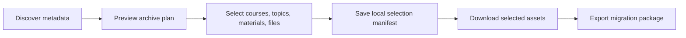

# Google Classroom Auto Archiver

[](https://github.com/grloper/google-classroom-auto-archiver/actions/workflows/ci.yml)
[](https://github.com/grloper/google-classroom-auto-archiver/actions/workflows/codeql.yml)

Fully automatic, local-first Google Classroom archive engine for migration, backup, and content indexing.

API-first Google Classroom archival engine with Playwright session fallback. It discovers accessible courses, crawls topics/coursework/materials/announcements, downloads Drive assets where permitted, writes SQLite metadata, and exports `output/master_index.json` for migration into another learning platform.

## What It Does

- Crawls all Classroom courses visible to the authorized Google account.
- Reads topics, coursework, materials, announcements, due dates, descriptions, and attachments.
- Downloads accessible Google Drive files.
- Exports Google Docs, Slides, Sheets, and Drawings into portable formats.
- Saves YouTube, Forms, and external links as structured references.
- Stores metadata in SQLite and JSON.
- Resumes interrupted runs and skips completed downloads.
- Keeps credentials, tokens, logs, databases, browser sessions, and downloaded files local-only.

## UI Dashboard

The engine includes a rich, local-only web dashboard to interact with your downloaded content safely.


*The "My Classroom" view elegantly visualizes downloaded courses, topics, materials, and assignments. Downloaded files can be opened natively directly from the UI.*


*The system details tab provides an overview of the local database layout and includes a secure "Factory Reset" option for testing without losing downloaded disk files.*

## System Flow



## Data Model



## Quick Start

1. Install dependencies:

   ```bash
   npm install
   ```

2. Copy `.env.example` to `.env` and adjust paths/settings.

3. Do the one manual Google Cloud setup that Google requires before first login:

   - Open the Google Cloud project you will use for this archive engine.
   - Enable **Google Classroom API** and **Google Drive API**.
   - Open **Google Auth Platform** / **OAuth consent screen**.
   - Keep the app in **Testing** mode for personal/dev use.
   - In **Audience** / **Test users**, add every Google account you may sign in with.
   - Create an OAuth client of type **Desktop app**.
   - Download the client JSON to `credentials/oauth-client.json`.

   This test-user step must happen before first login. If it is missing, Google shows:

   ```text
   Access blocked: app has not completed the Google verification process
   Error 403: access_denied
   ```

4. Run the engine:

   ```bash
   npm run engine
   ```

   On first run, the engine performs preflight checks, opens Google OAuth in your normal browser, saves the token, crawls Classroom, downloads accessible Drive files, writes SQLite, and exports JSON. On later runs it skips login and resumes the archive.

## What Happens After Login

After OAuth succeeds, the same engine run continues automatically:

- Discovers all accessible courses.
- Crawls topics, coursework, materials, announcements, and attachments.
- Downloads Drive files where your account has access.
- Exports Google Docs/Slides/Sheets into portable formats.
- Saves references for YouTube, Forms, and external links.
- Writes `database/classroom.db`.
- Writes `output/master_index.json`.
- Organizes course content under `output/courses/`.

Rerun this whenever you want to update or resume the archive:

```bash
npm run engine
```

## Commands

```bash
npm run engine        # preflight, login if needed, crawl, download, export
npm run backup        # same as engine
npm run doctor        # check local credentials/token/database setup
npm run login         # auth-only repair command
npm run crawl         # low-level crawl/download/export command
npm run export        # regenerate JSON from SQLite
npm run api           # local JSON API for future frontend work
npm run sanitize:check # verify public files do not contain obvious private data
npm run compliance:check # validate local-only and release safety rules
npm run release:check # check, test, sanitize, compliance, audit
npm test              # parser/storage-safe unit tests
```

Useful crawler flags:

```bash
npm run engine -- --no-download
npm run engine -- --export-only
npm run engine -- --api-only
npm run engine -- --ui-only
```

## Output

```text
output/
  courses/
    Math_Class/
      Algebra/
        Quadratics/
          worksheet.pdf
          lesson.docx
          lesson.pdf
          assignment.json
  master_index.json
database/
  classroom.db
logs/
  archiver.log
```

## Security Notes

`GOOGLE_PASSWORD` is intentionally not used. Google accounts commonly require MFA, risk checks, and browser-bound trust state; scripting a password flow is brittle and unsafe. Run `npm run engine`, complete Google auth in the normal browser when prompted, and future runs use the local token file. Tokens and downloaded archives are ignored by git.

If you see "Couldn't sign you in. This browser or app may not be secure", close the Playwright browser and run:

```bash
npm run engine
```

Do not use the Playwright browser for Google sign-in unless you specifically need UI fallback testing.

If you see `Error 403: access_denied` and Google says the app has not completed verification, add the signing-in Google account under **Google Auth Platform** / **Audience** / **Test users**, then rerun `npm run engine`.

## Public Repo Safety

The repository is designed to be public-safe. The following are ignored by git:

- `.env`
- `credentials/*.json`
- `sessions/**`
- `database/*.db`
- `database/*.db-*`
- `logs/**`
- `output/master_index.json`
- `output/courses/**`

Before publishing, run:

```bash
npm run release:check
```

## CI/CD And Environments

The public repository includes GitHub Actions for:

- CI on `main`, `develop`, `staging`, and pull requests.
- Node.js 20 and 22 validation.
- CodeQL JavaScript analysis.
- Tag-based release publishing.
- Weekly Dependabot checks for npm and GitHub Actions.

Release channels:

- `vX.Y.Z-rc.N` creates a staging prerelease.
- `vX.Y.Z` creates a production release.

See [docs/environments.md](docs/environments.md) for branch, staging, production, and compliance gates.

## Next Level UI

The next planned milestone is a local dashboard for choosing exactly what to download before the download phase starts.



See [docs/ui-roadmap.md](docs/ui-roadmap.md) for the implementation plan.
See [docs/prompts/selective-download-ui.prompt.json](docs/prompts/selective-download-ui.prompt.json) for the end-to-end JSON implementation prompt.

## Current API Coverage

The API crawler uses:

- `courses.list`
- `courses.teachers.list`
- `courses.topics.list`
- `courses.courseWork.list`
- `courses.courseWorkMaterials.list`
- `courses.announcements.list`
- `drive.files.get`
- `drive.files.export`

Relevant official references:

- Classroom coursework list: https://developers.google.com/workspace/classroom/reference/rest/v1/courses.courseWork/list
- Classroom materials list: https://developers.google.com/workspace/classroom/reference/rest/v1/courses.courseWorkMaterials/list
- Classroom topics list: https://developers.google.com/workspace/classroom/reference/rest/v1/courses.topics/list
- Drive file export: https://developers.google.com/drive/api/v3/reference/files/export

The UI crawler is intentionally conservative: it can discover course cards from Classroom when API mode is unavailable, while keeping Playwright session support ready for expanding UI-only scraping later.
