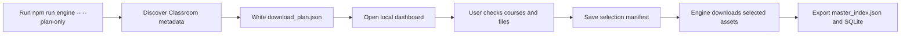

# Selective Download UI Roadmap

The engine is API-first today. The next product step is a local dashboard for reviewing the archive plan before downloads run.

For an implementation-ready JSON prompt, see [prompts/selective-download-ui.prompt.json](prompts/selective-download-ui.prompt.json).

## Goals

- Show discovered courses, topics, materials, and attachments before downloading.
- Let the user select exact courses, topics, material types, or individual attachments.
- Estimate file counts and approximate download volume from Drive metadata.
- Save the selection as a local manifest so interrupted runs can resume.
- Keep all tokens, browser profiles, and downloaded files local-only.

## Proposed Flow

## Implementation Milestones

1. Add `--plan-only` to crawl metadata without downloads.
2. Add a `download_selection` table or JSON manifest.
3. Extend `src/api/server.js` with read/write endpoints for selections.
4. Serve a local static dashboard from `src/ui`.
5. Add filtered download execution in `downloadManager`.

## Local-Only Security Model

The UI should bind to `127.0.0.1` only. It should never upload tokens, archive contents, or course metadata to a hosted service.
